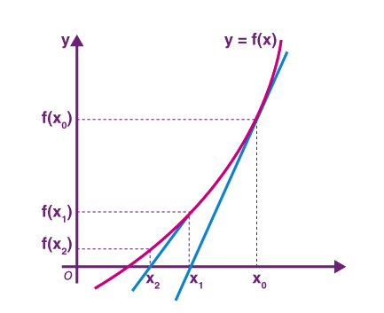

## 知识点

### 交换两个数字

方式一： 通过临时变量交换（最常用，但需要额外空间）

```java
int a = 2;
int b = 3;

int temp = a;
a = b;
b = temp;
```

方式二： 通过加减计算交换（可能引起溢出）

```java
int a = 2;
int b = 3;

a = a + b;
b = a - b;
a = a - b;
```

方式三： 通过异或运算交换（性能高但可读性较差）

```java
int a = 2;
int b = 3;

a = a ^ b;
b = a ^ b;
a = a ^ b;
```

### 牛顿迭代法

牛顿迭代法或牛顿法，它是一种在实数域和复数域上近似求解方程的方法。方法使用函数${\displaystyle f(x)}$的泰勒级数的前面几项来寻找方程${\displaystyle f(x)=0}$的根。

初始时我们从给定的$f(x)$和一个近似解$x_0$开始，假设我们目前的近似解是$x_i$，我们画出与$f(x)$切于点$(x_i,f(x_i))$的直线$l$，将$l$与$x$轴的交点横坐标记为$x_{i+1}$，那么这就是一个更优的近似解，重复这个迭代的过程，将逐渐逼近方程的解。 



根据导数的几何意义，可以得到如下关系：
$$f'(x_i) = \frac{f(x_i)}{x_{i} - x_{i+1}}$$
整理后得到如下递推式：
$$x_{i+1} = x_i - \frac{f(x_i)}{f'(x_i)}$$
直观地说，如果$f(x)$比较平滑，那么随着迭代次数的增加，$x_i$会越来越逼近方程的解。

牛顿迭代法的收敛率是平方级别的，这意味着每次迭代后近似解的精确数位会翻倍。


参考：
1. [牛顿迭代法](https://oi-wiki.org/math/numerical/newton/)（收录了收敛证明以及相关缺陷的参考文献）
2. [Newton Raphson Method](https://byjus.com/maths/newton-raphson-method/)

## 练习题目

**题目**


**思路**


