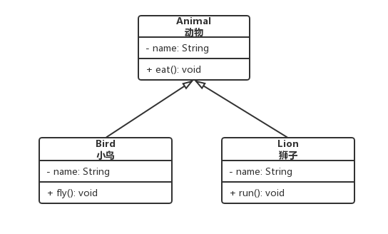

六种基本关系按”泛化（继承）>实现>组合>聚合>关联>依赖“的顺序由强到弱。

1. 泛化（Generalization）
概念：继承关系，表示一般与特殊的关系，指定子类如何特殊化父类的特征和行为。
语言：is a关系
代码：类的继承（extends关键词）
UML表示：用带空心三角箭头的实线来表示泛化关系，箭头从子类指向父类。

2. 实现（Realization）
概念：
语言：
代码：
UML表示：

3. 组合（Composition）
概念：
语言：
代码：
UML表示：

4. 聚合（Aggregation）
概念：
语言：
代码：
UML表示：
5. 关联（Association）

6. 依赖（Dependency）

IDEA中的类图表示：