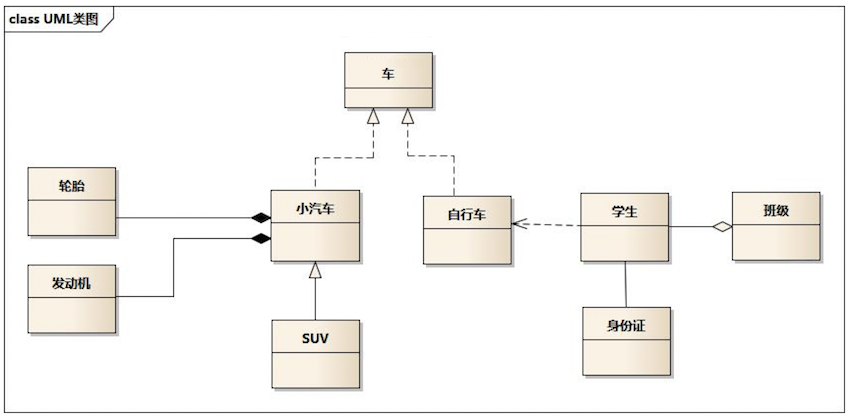

六种基本关系按”实现、泛化>组合>聚合>关联>依赖“的顺序由强到弱。

## 1. 实现（Realization）

概念：接口及其实现类之间的关系。

语言：-

Java代码：接口的实现（implements关键词）

UML表示：用带空心三角箭头的虚线来表示实现关系，箭头从实现类指向接口。

## 2. 泛化（Generalization）

概念：表示一般与特殊的关系，指定子类如何特殊化父类的特征和行为。

语言：is a关系

Java代码：类的继承（extends关键词）

UML表示：用带空心三角箭头的实线来表示泛化关系，箭头从子类指向父类。

## 3. 组合（Composition）

概念：整体和部分之间的关系，也是关联关系的一种。部分对象不能脱离整体对象而单独存在，如人的身体和大脑之间的关系，大脑不能脱离身体而单独存在。

语言：contains a关系

Java代码：部分对象是整体对象的一个成员变量

UML表示：用带实心菱形的实线来表示组合关系，菱形指向整体。（指向部分的一方也可加上箭头）

## 4. 聚合（Aggregation）

概念：整体和部分之间的关系，也是关联关系的一种。成员也可以脱离整体而存在。如老师是学校的一部分，同时老师也是独立的个体，可以单独存在。

语言：has a关系

Java代码：部分对象是整体对象的一个成员变量

UML表示：用带空心菱形的实线来表示聚合关系，菱形指向整体。（指向部分的一方也可加上箭头）

## 5. 关联（Association）

概念：对象之间的一种引用关系，它使一个对象知道另一个对象的属性和方法，如老师和学生，丈夫和妻子等。

语言：长期固定的，use a关系

Java代码：成员变量

UML表示：单向关联用一个带箭头的实线表示，箭头从使用类指向被关联的类，双向关联用带箭头或者没有箭头的实线来表示。

## 6. 依赖（Dependency）

概念：表示一种使用关系，即一个类的实现需要另一个类的协助。比如程序员和计算机的关系，程序员使用计算机，二者之间就是依赖关系。

语言：短期临时的，use a关系

Java代码：方法中的局部变量、方法或构造器的参数、方法的返回值

UML表示：用带箭头的虚线表示，箭头从使用类指向被依赖的类。

**说明：**

1. 关联与依赖：关联表示一种长期的固定的关系，而依赖表示一种短期的临时的关系。关联作为成员变量存在，而依赖作为方法参数存在。
2. 组合与聚合：两者都是强关联关系，区别在于部分能否脱离整体而存在。部分不可以脱离整体，为组合关系，部分可以脱离整体，为聚合关系。
3. IDEA中的类图表示与UML规范略有不同，原因在于，如果没有人为干预，程序无法区分组合、聚合、关联，因此这三种关系的表示是相同的，都为实心菱形加箭头实线。
4. 一个完整的例子：

- 车是接口
- 小汽车、自行车实现车类，他们之间是实现关系
- SUV继承小汽车，他们之间是泛化关系
- 轮胎、发动机和小汽车是组合关系（轮胎、发动机是部分，小汽车是整体）
- 学生和班级是聚合关系（学生是部分，班级是整体）
- 学生和身份证是关联关系
- 学生与自行车是依赖关系

**参考：**

1. [终于明白六大类UML类图关系了](https://segmentfault.com/a/1190000021317534)
2. [30分钟学会UML类图](https://zhuanlan.zhihu.com/p/109655171)
3. [UML类图中的六种关系(物理设计阶段)](https://www.cnblogs.com/NeilZhang/p/10278995.html)
