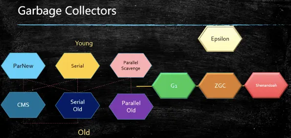
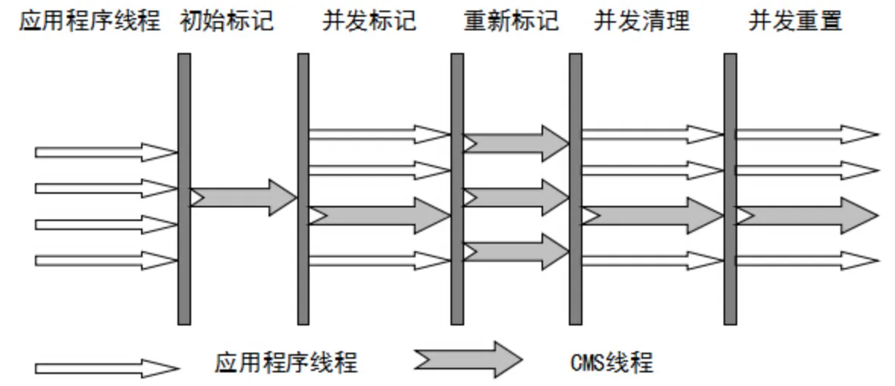

## Serial

串行，标记-复制，新生代

## Serial Old

串行，标记-整理，老年代

作为CMS后备方案：在执行CMS GC的过程中同时业务线程将对象放入老年代，而此时老年代空间不足，或者在做Minor GC的时候，新生代Survivor空间放不下，需要放入老年代，而老年代也放不下而产生的

## Parallel Scavenge

并行，标记-复制，新生代

## Parallel Old

并行，标记-整理，老年代

## ParNew

并行，标记-复制，新生代，配合CMS

## CMS

**以获取最短回收停顿时间为目标的收集器，使垃圾回收基本上可以和用户线程一起工作。**

与用户线程并行，标记-清除（所以有碎片，可能触发为串行回收），老年代

算法：三色标记

三标一清：

- **初始标记：** 暂停所有的其他线程，并记录下**直接与root相连的对象**，速度很快 ；
- **并发标记：** 同时开启GC和用户线程，用一个闭包结构去**记录可达对象**。因为用户线程可能会不断的更新引用域，所以这个算法里会跟踪**记录这些发生引用更新的地方**。
- **重新标记：** 重新标记阶段就是为了**修正**并发标记期间因为用户程序继续运行而导致标记产生变动的那一部分对象的标记记录，这个阶段的停顿时间一般会比初始标记阶段的时间稍长，远远比并发标记阶段时间短
- **并发清除：** 开启用户线程，同时GC线程开始对为标记的区域做**清扫**。

## G1

**主要针对配备多颗处理器及大容量内存的机器. 以极高概率满足GC停顿时间要求的同时,还具备高吞吐量性能特征。**

200ms - 10ms

算法：三色标记 + SATB

1、仍然保留分代的逻辑概念，但物理上将堆区分为很多个Region，每个Region属于某个代。

2、各过程与CMS很类似，但处理Region之间的引用以及用户线程的引用更新的算法更加复杂。

3、G1维护一个优先列表，根据允许的收集时间，优先选择回收价值最大的Region。

## Shenandoah

算法：ColoredPointers + WriteBarrier

## ZGC

10ms - 1ms

算法：ColoredPointers + LoadBarrier

## Epsilon

无垃圾回收
