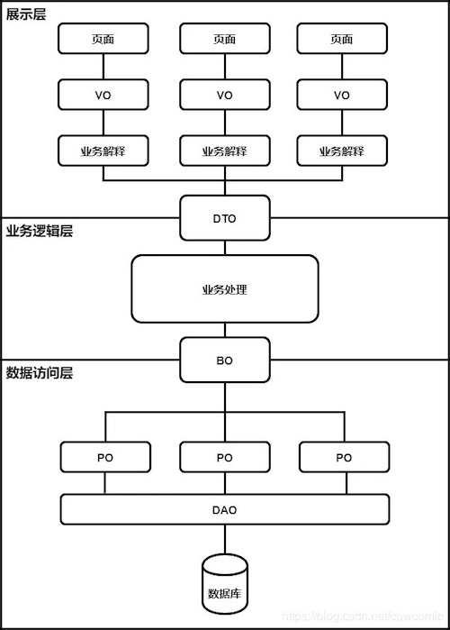

## PO、DTO、VO



**PO（Persistant Object）持久对象**

等同于Entity，简单说PO就是数据库中的记录，一个PO的数据结构对应着库中表的结构，表中的一条记录就是一个PO对象。

通常PO里面除了get，set之外没有别的方法。

**BO（Business Object）业务对象**

BO就是PO的组合。简单的例子比如说PO是一条交易记录，BO是一个人全部的交易记录集合对象。复杂点儿的例子PO1是交易记录，PO2是登录记录，PO3是商品浏览记录，PO4是添加购物车记录，PO5是搜索记录，BO是个人网站行为对象。

BO是一个业务对象，一类业务就会对应一个BO，数量上没有限制，而且BO会有很多业务操作，也就是说除了get，set方法以外，BO会有很多针对自身数据进行计算的方法。

为什么BO也画成横跨两层呢？原因是现在很多持久层框架自身就提供了数据组合的功能，因此BO有可能是在业务层由业务来拼装PO而成，也有可能是在数据库访问层由框架直接生成。

很多情况下为了追求查询的效率，框架跳过PO直接生成BO的情况非常普遍，PO只是用来增删改使用。

**DTO（Data Transfer Object）数据传输对象**

直接从前端过来的json转换成的java对象，或者是业务处理好，需要传给前端的对象，可以以Request、Response、DTO为后缀。

注：BO和DTO的区别

这两个的区别主要是就是字段的删减。BO对内，为了进行业务计算需要辅助数据，或者是一个业务有多个对外的接口，BO可能会含有很多接口对外所不需要的数据，因此DTO需要在BO的基础上，只要自己需要的数据，然后对外提供。在这个关系上，通常不会有数据内容的变化，内容变化要么在BO内部业务计算的时候完成，要么在解释VO的时候完成。

**VO（Value Object）值对象**

展示层，对应前端js的json。

注：VO和DTO的区别

主要有两个区别：一个是字段不一样，VO根据需要会删减一些字段；另一个是值不一样，VO会根据需要对DTO中的值进行展示业务的解释。

举个简单的例子，DTO可能是这样的：

```json
{
	"gender":"男",
	"age":35
}
```

复制代码对于业务一来说只需要性别，而且因为是一个古风聊天室，也不能直接展示男，因此经过业务解释业务一的VO是

```json
{
	"gender":"公子"
}
```

**什么是DO？**

现在主要有两个版本，一个是阿里巴巴的开发手册中的定义，DO（Data Object）这个等同于上面的PO；另一个是在DDD（Domain-Driven Design）领域驱动设计中，DO（Domain Object）这个等同于上面的BO。

**什么是POJO？**

在阿里手册中， POJO（Plain Ordinary Java Object）专指只有setter/getter/toString的简单类，包括DO/DTO/BO/VO等。

一些工作中的最佳实践：

